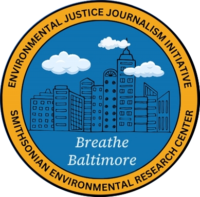

# Breathe-Baltimore

**Overview**

Breathe Baltimore is a community-based research project aimed at addressing air quality issues in Baltimore. The project brings together local communities, researchers, and volunteers to collect hyperlocal air quality data in neighborhoods where there is a lack of information on outdoor air pollutants. This data helps us better understand environmental conditions and how they impact the health and well-being of residents.

**Who's Involved?**

The project is a collaboration between:

[Environmental Justice Journalism Initiative (EJJI)](https://www.ejji.org) and the [Smithsonian Environmental Research Center (SERC)](https://serc.si.edu).
Additionally, site stewards and volunteers from the community play an essential role in maintaining the sensors and gathering data.

**What Data Are We Collecting?**

The sensors deployed in this project measure the following air pollutants:

Particulate Pollution
Ozone
Carbon Dioxide (CO₂)
These pollutants have significant impacts on human health and environmental conditions. To learn more about each pollutant and their effects, [visit the project website](https://www.ejji.org/air-quality-monitoring-in-baltimore).

**Data Collection Frequency**

The sensors collect data every 5 minutes, offering near real-time insight into the air quality of the surrounding area.

**Potential Uses of the Data**

While the data is not legally defensible or regulatory, it can still serve numerous valuable purposes, including:

Identifying air quality hotspots
Informing future data collection priorities
Revealing patterns and trends in outdoor air quality across neighborhoods
Supporting community stories and real-life experiences
Educating the public on air quality issues

**Reporting Area**

TBD!

  

